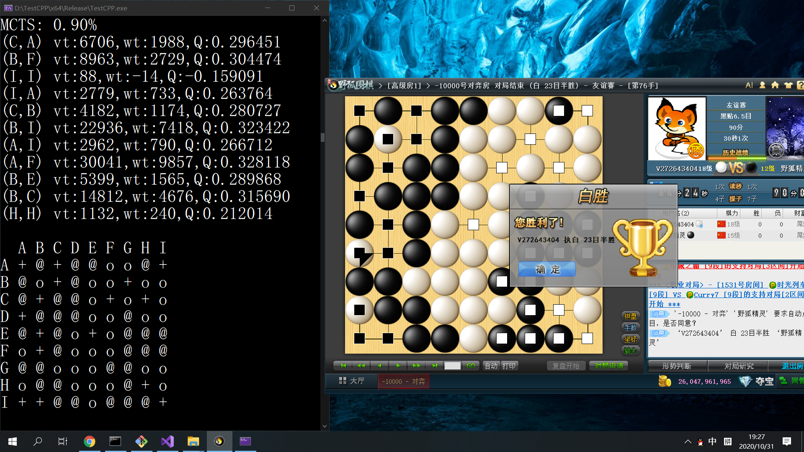
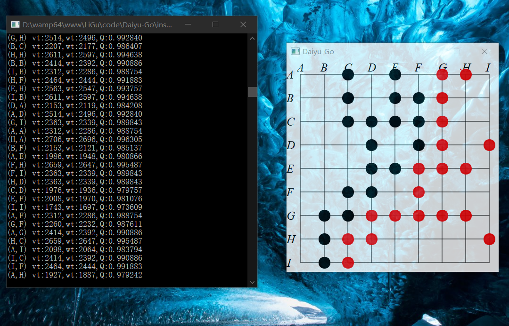
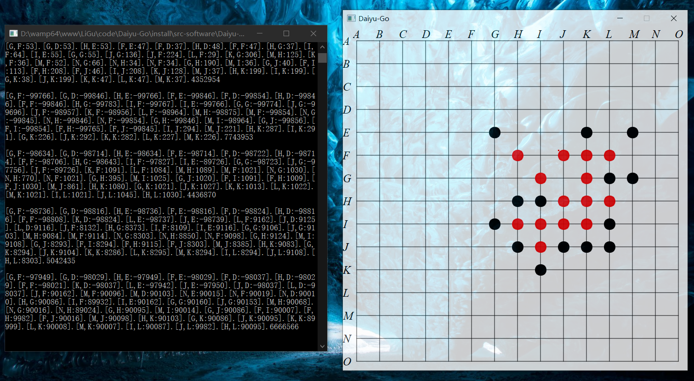
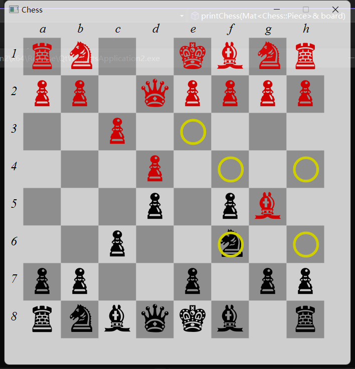

# LiGu's AI of Game

[TOC]

## [Go 围棋](Go.md)
* AI Algorithm: [Montecarlo Tree Search](Monte_Carlo_Tree_Search.md)  
* 
* 
* Operate
  - Press mouse left button: move stone
  - Press mouse middle button: return to the previous state
  - Press key P: Pass
  - Press key A: open AI
  - Press key S: display AI evaluation results
  - Press key Q: display qi of each stone
  - Press key N: display order of each stone
  - Press key M: display mark and ID of each stone

## [GoBang 五子棋](Gobang.md) 
* AI Algorithm: [Decision Tree, Minimax, alpha-beta Prune](Minimax.md)  
* 

## [Chess 象棋](Chess.md) 
* 
* Operate
  - Press mouse left button: move stone
  - Press mouse middle button: return to the previous state