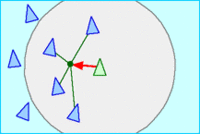

# Boids

[TOC]

**Boids** is an artificial life program, developed by Craig Reynolds in 1986, which simulates the flocking behaviour of birds, and related group motion.

## Rules

- **Collision Avoidance**: avoid collisions with nearby flock mates.
- **Velocity Matching**: attempt to match velocity with nearby flock mates.
- **Flock Centering**: attempt to stay close to nearby flock mates.

## Process
[可见域内]:
		[1] 可见距离判定
		[2] 可见角度判定
	[Rule 1]: 可见域内，同各个个体的反向方向，除以距离，作为加速度 a1
	[Rule 2]: 可见域内, 质心速度, 作为加速度 a2
	[Rule 3]: 可见域内, 质心位置方向, 作为加速度 a3
	[障碍规避]:
		[1] 生成均匀球面点分布
		[2] 依次从速度方向,向四周,发出射线进行障碍检测,射线距离在可见域内
		[3] 选择第一束探测无障碍的射线, 作为避障加速度 a4
	[ v ]: v = (Σwi·ai)·dt
			v 归一化单位矢量: ^v  =>  v = v0·^v
	[ r ]: r = v·dt = v0·dt·^v

## Reference

- Thanks for https://github.com/SebLague/Boids