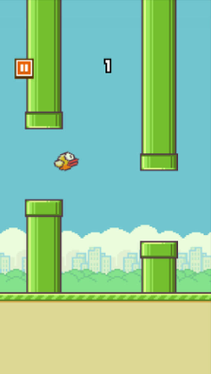

# Flappy Bird

[TOC]

## Introduction

Flappy Bird is a popular mobile game developed by ***Dong Nguyen*** that gained immense popularity due to its simple yet addictive gameplay. *Flappy Bird* is a side-scrolling, 2D mobile game where the player controls a bird that must navigate through a series of pipes. The objective is to achieve the highest score possible by passing through the maximum number of pipes.

### Game Elements

1. **Bird:**
   - The main character controlled by the player.
   - Flaps its wings when the player taps on the screen.
   - Affected by gravity, causing it to fall continuously.
   - The movement mechanism of birds is vertical parabolic motion.
   
2. **Pipes:**
   - Vertical, green pipes that appear on the screen at regular intervals.
   - The height of pipeline voids is random.
   - The bird must navigate through the gaps between the pipes.
   - If the bird collides with a pipe or the ground, the game ends.
   
3. **Score:**
   - Players earn one point for each successfully navigated pair of pipes.
   - The score is displayed on the screen, providing a constant feedback loop to the player.

4. **Ground:**
   - The bottom boundary of the game screen.
   - Colliding with the ground results in the end of the game.
